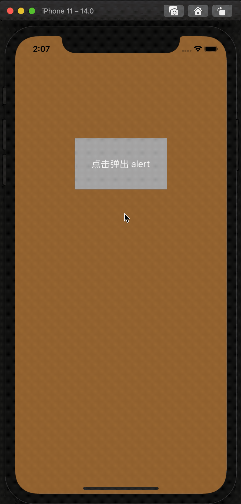

# HLBAlertViewController

## 动态示例



## 编写初衷

`UIAlertController` 的页面难以自定义。

## 简介

`HLBAlertViewController` 的 *transition* 和 *presentation* 类似于 `UIAlertController`，但可以高度自定义 alert 页面的内容。

## 集成

在 Podfile 中添加：

```
pod 'HLBAlertViewController'
```

## 使用方法

- 创建 `HLBAlertView` 的子类，添加自定义的控件。
- 创建 `HLBAlertViewController` 的子类，并实现 `-customizedAlertView:` 代理方法（`HLBAlertViewController` 中已遵守协议并设置了代理，子类只需要实现代理），此代理的返回值是 `HLBAlertView` 的子类。按钮的点击事件也在这个子类中添加。

详情请看 **HLBAlertViewControllerExample** 中的示例代码。